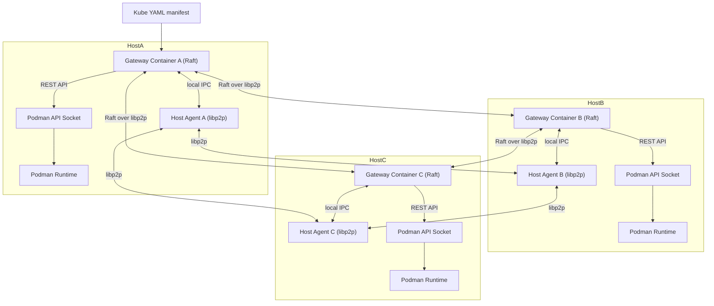

# Description

* Each host in the cluster runs two key components:

## Host Agent

* Runs natively on the host.

* Maintains libp2p connections with agents on other hosts.

* Provides a secure, authenticated transport layer for inter-host communication.

* Forwards Raft messages between gateways.

## Gateway Pod

* A Podman-managed pod containing the Gateway container.

* Connects to the local Podman API socket to deploy and reconcile workloads.

* Runs the Raft consensus algorithm, using the Host Agent’s libp2p network for communication.

* Ensures that all gateways agree on a single replicated log of desired manifests.

# Workflow

* A user submits a Kubernetes-style manifest (kube.yaml) to any Gateway.

* The Gateways reach consensus via Raft (transported over the libp2p Host Agent mesh).

* Once committed, each Gateway applies the manifest locally by calling podman kube play through the Podman API socket.

* The result is a synchronized, multi-host Podman cluster where workloads are consistently deployed and managed across all participating hosts.

# Key Features

* Podman-native orchestration using existing Kubernetes YAML manifests.

* Decentralized peer-to-peer networking with libp2p.

* Strong consistency guarantees from Raft.

* Separation of responsibilities: Host Agents handle networking, Gateways handle consensus, Podman handles execution.

# Architecture

# Beemesh

This repository contains multiple crates for beemesh. A new `beemesh-protocol` crate was added to hold FlatBuffers schemas and generated code used for IPC between the gateway and host.

beemesh-protocol
- Schema files live in `beemesh-protocol/schema/`.
- `build.rs` will run `flatc --rust` to generate Rust files into `beemesh-protocol/src/generated/`.
- The crate exposes helpers for building message buffers.